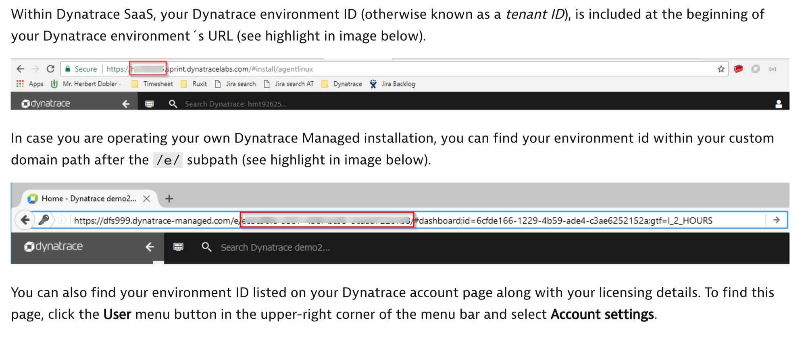
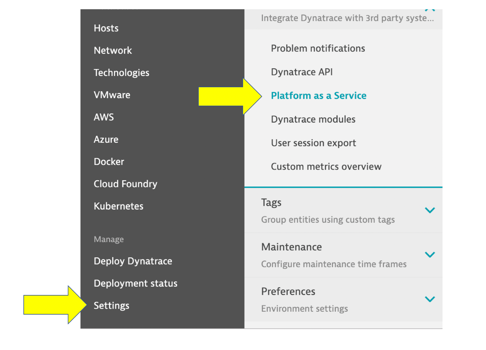
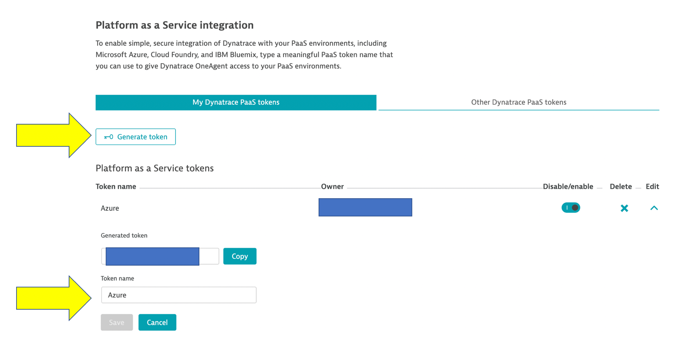

# Overview

This demo contains examples for how to setup [Dynatrace monitoring on Azure](https://www.dynatrace.com/support/help/technology-support/cloud-platforms/microsoft-azure/)

Dynatrace offers the following Azure monitoring capabilities.  Bulleted items below with a subfolders have README files and scripts to show how you can check it out. Feedback is welcome.  Just email me @ rob.jahn@dynatrace.com

## OneAgent

Compute services such as Virtual Machines or App Services provide extension mechanisms for easily extending service capabilities. These make deployment of OneAgent easier than ever—whether it's done through Azure Portal, Powershell, Azure Cli, or directly using the Azure Resource Manager API.

* Azure Virtual Machine
* Virtual Machine Scale Set
* Service Fabric
* [Azure Webapps](./webapp/README.md)
* Azure function Apps
* Azure Kubernetes Service (AKS)
* HDInsight
* Cloud-Services (Classic)

## Dynatrace Azure Monitor

Dynatrace integration with Azure Monitor adds cloud infrastructure monitoring, which provides deep insight into service behavior, as well as precise, AI-powered answers, even within serverless application scenarios.

* Setup Dynatrace Gateway to Azure

# Dynatrace tenant and PaaS token

Each examples this repo will require obtaining your Dynatrace tenant and PaaS token.  Refer to offical Dynatrace documentation, but you can follow this as a quick guide.

## Environment ID

Refer to these docs taken from [Dynatrace Docs](https://www.dynatrace.com/support/help/reference/dynatrace-concepts/why-do-i-need-an-environment-id/)

## PaaS token

1. Login into Dynatrace and click on these menu items: Settings -> Integration -> Platform as a Service.

2. On the the 'Platform as a Service' page:
* Click the 'Generate token' button and provide a meaningful name for your token. A meaningful token name might be the name of the platform you want to monitor (for example, azure, cloud-foundry, or openshift).
* Click Generate to create the token. The newly created token will appear in the 'My Dyantrace PaaS tokens' list.  
* Click Copy to copy the generated token to the clipboard as shown below. You can do this at any time by revisiting this page and clicking Show token next to the relevant PaaS token.

