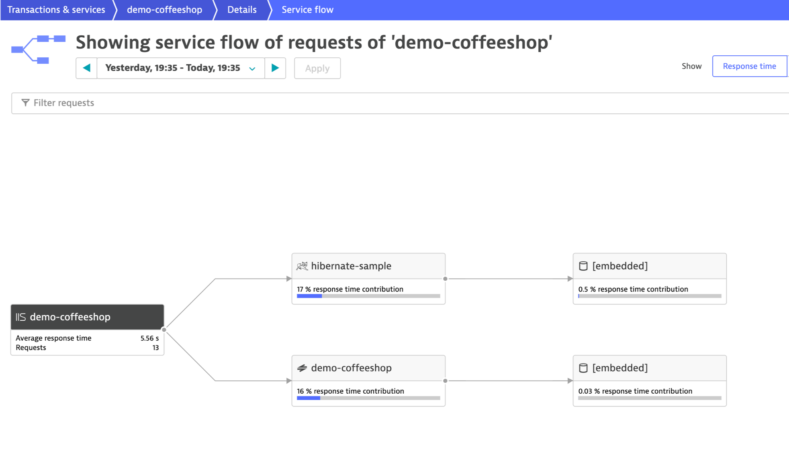
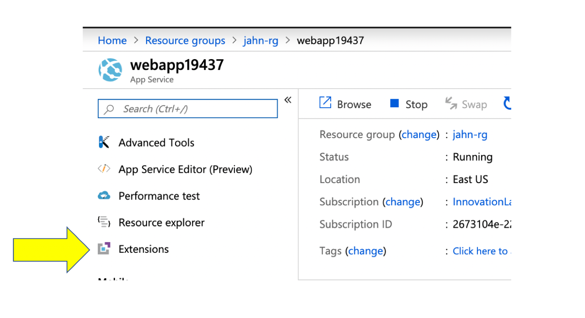
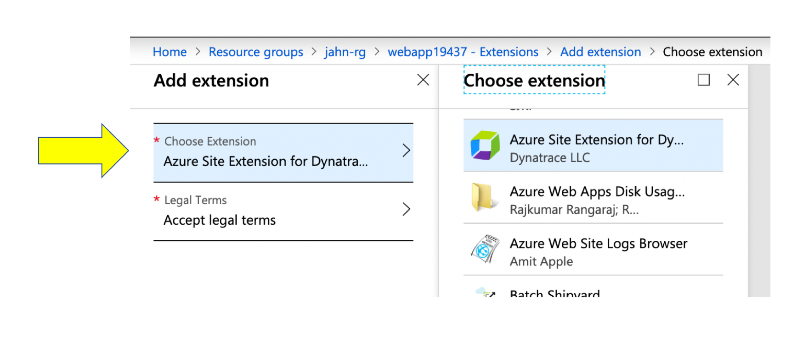
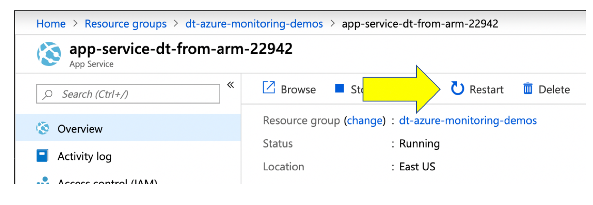
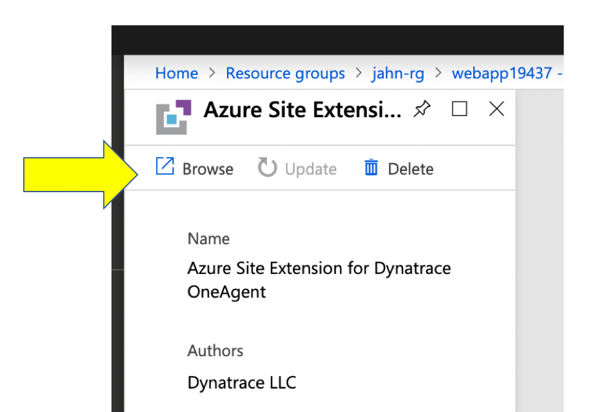
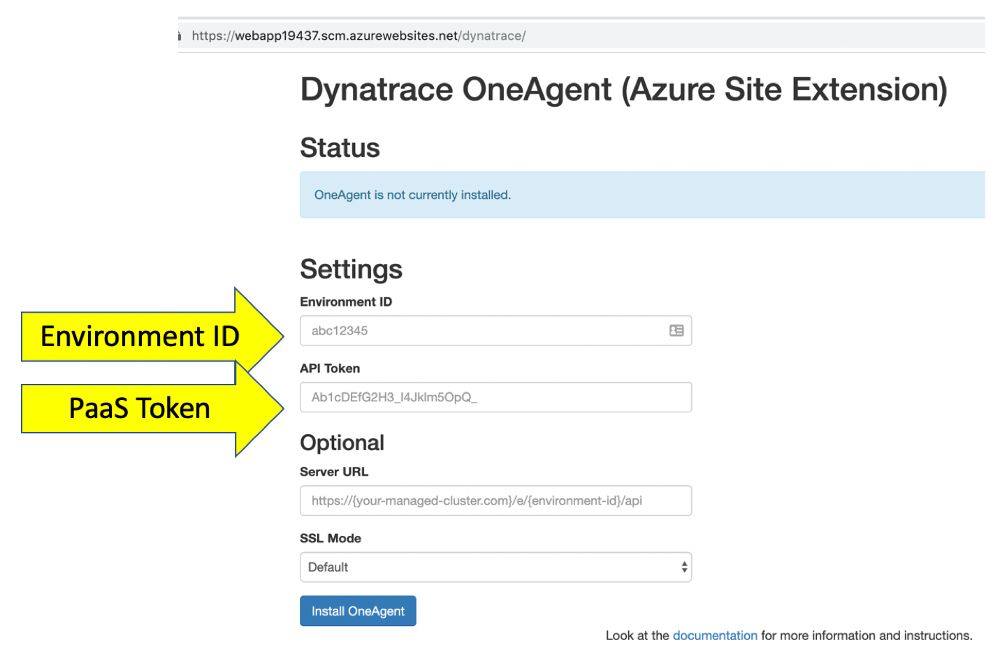
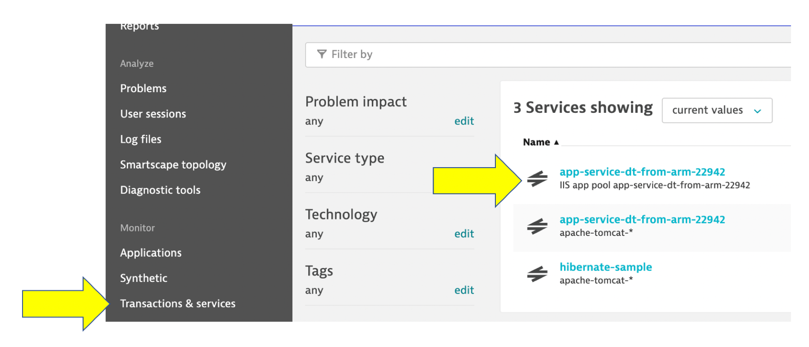

# Azure WebApps

This example will deploy a sample [Java application from Microsoft App Service Repo](https://github.com/azure-appservice-samples/JavaCoffeeShopTemplate).  This application is an coffee shopping cart site with an embedded database.

Resources are added to a resource group called ```dt-azure-monitoring-demos``` so just delete this group when finished.


The service flow in Dynatrace it looks like this.



## Option 1: Add Dynatrace OneAgent in the Azure Portal 

This example will create a web app and deploy the sample app to it.  Once created, you will use the Azure portal to manually install and configure the Dynatrace agent.  

### The files involved are:
* create-webapp-no-dynatrace.sh - This uses the Azure CLI to provision the web app and deploy the code

### Steps

1. Assuming you have the [Azure CLI](https://docs.microsoft.com/en-us/cli/azure) installed and configured, run this Unix Bash script ```create-webapp-no-dynatrace.sh``` to provision the web app.  This script will show the URL as output after it runs.  For example:
    ```
    ================================================
    Copy this URL into a browser to see the web app.
    http://app-service-dt-from-arm-32451.azurewebsites.net
    ```

2. Once the web app is running, goto the Azure app service page, choose the 'extention' menu and click the 'Add' button



3. Pick the 'Azure Site extention for Dyntrace' and accept terms.



4. Once installed, go to overview page and click the 'restart' button.



5. Once restarted, navigate back to the extensions list and click on the Dynatrace extention to open up the detail page. On the detail page choose the 'browse button'.  It might take a minute or two to become available.



6. On the configuration page, enter the value then 'Install agent' button
* Dynatrace environment id
* Dynatrace token - this is PaaS token NOT the API token



7. Visit the sample application and click around the pages so that Dynatrace can capture metrics. 

8. Login to Dynatrace and view the 'Transactions and services' page



## Option 2: Add Dynatrace OneAgent using ARM Template

This example will create a web app AND install the Dynatrace agent using ARM templates. 

### The files involved are:

* webapp-arm-template.json - the ARM template to provision the web app
* webapp-parameters.json - parameters to the ARM template
* create-webapp-with-dynatrace.sh - This uses the Azure CLI to provision the web app and deploy the code

A second step will deploy the sample app to the web app.  

### Steps

1. Copy the ```webapp-parameters.json.template``` to ```webapp-parameters.json```

2. Edit ```webapp-parameters.json``` with the values for your environment refering to notes within the template
* subscriptionId
* dynatraceEnvironmentId
* dynatracePaasToken
* dynatraceApiUrl

3. Assuming you have the [Azure CLI](https://docs.microsoft.com/en-us/cli/azure) installed and configured, run this Unix Bash script ```create-webapp-with-dynatrace.sh``` to provision the web app. This script will show the URL as output after it runs.  For example:
    ```
    ================================================
    Copy this URL into a browser to see the web app.
    http://app-service-dt-from-arm-32451.azurewebsites.net
    ```

4. Visit the sample application and click around the pages so that Dynatrace can capture metrics. 

5. Login to Dynatrace and view the 'Transactions and services' page


## Generate some traffic 

You can just visit the application manually or you can use the ```sendload.sh``` script.  It will run for 15 seconds sending a few CURL requests every 2 seconds. This script takes the demo app base URL as an argument and an optional second parameter for duration in seconds to override the default time.  

For example for 30 seconds:
```
./sendload.sh https://<Your app>.azurewebsites.net 30
```


## Reference

* [Azure documentation](https://azure.microsoft.com/en-us/services/app-service/web/)
* [Dynatrace documentation](https://www.dynatrace.com/support/help/technology-support/cloud-platforms/microsoft-azure/azure-services/app-service/)
